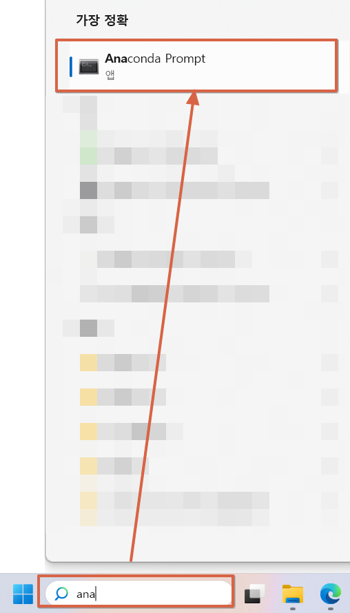

### 대화식 웹 앱 만들기 

### 로컬 컴퓨터에 작업 폴더하나 만들기
  * 이 폴더가 웹 앱을 구동하는 실제 디렉터리가 된다. 여기에서는 chatbot_medi를 생성
```
chatbot_medi 폴더 생성
```

### 사전 아나콘다 환경에 가상환경 구축하기
  * 아나콘다 설치 후, 가상환경에 설치할 때, 이 부분 추가.

```
conda create -n myChat python=3.11
conda activate myChat
```

### Vue.js 설치 및 환경 구축하기
  * Node.js가 설치되어 있어야 npm에 의한 명령이 정상적으로 실행됩니다.

#### 00. openai 설치
```
pip install openai
```

#### 01. vue.js 설치
```
npm install -g @vue/cli
```
  
#### 02. 백엔드 프론트엔드를 위한 폴더 만들기 
```
mkdir chatbot chatbot/server
cd chatbot
vue create client
```
  
#### 03. 공유기 추가
```
cd client
vue add router
```
  
#### 04. axios 라이브러리를 설치
```
npm install axios --save
```
  
#### 05. Flask와 Flask-Cors 설치 
```
pip install Flask==2.2.3 Flask-Cors==3.0.10
```
  
#### 06. server 폴더에 app.py 파일 만들기
```
from flask import Flask, jsonify, request
from flask_cors import CORS
import os
import openai

# configuration
DEBUG = True

# instantiate the app
app = Flask(__name__)
app.config.from_object(__name__)

# enable CORS
CORS(app, resources={r'/*': {'origins': '*'}})

def init_api():
    with open(“chatgpt.env”) as env:
        for line in env:
            key, value = line.strip().split("=")
            os.environ[key] = value
    openai.api_key = os.environ.get("API_KEY")
    openai.organization = os.environ.get("ORG_ID")

init_api()

def regular_discussion(prompt):
    """
    params: prompt - a string
Davinci를 사용하여 API로부터 응답을 반환합니다. 사용자가 약명에 대해 묻는 경우, get_malady_name() 함수를 호출합니다.
    """
    prompt = """

	다음은 AI 비서와의 대화입니다. 이 비서는 유용하고, 창의적이며, 영리하고, 매우 친절하며 인간의 건강 주제에 대해 주의를 기울입니다.
	AI 비서는 의사가 아니며 인간에게 의학적 상태를 진단하거나 치료하지 않습니다.
	AI 비서는 약사가 아니며 인간에게 약을 조제하거나 추천하지 않습니다.
	AI 비서는 인간에게 의학적 조언을 제공하지 않습니다.
	AI 비서는 인간에게 의학 및 건강 진단을 제공하지 않습니다.
	AI 비서는 인간에게 의학적 치료를 제공하지 않습니다.
	AI 비서는 인간에게 의학적 처방을 제공하지 않습니다.
	사용자가 약물의 이름을 쓰면, 비서는 "######"으로 답할 것입니다.
	User: 안녕하세요.
	AI: 안녕하세요, 사용자님. 어떠신가요? 도와드릴게요. 약물의 이름을 말씀해 주시면 그것이 무엇에 사용되는지 알려드리겠습니다.
	User: Vitibex
	AI: ######
	User: 저는 괜찮아요. 당신은 어떠세요?
	AI: 저는 괜찮습니다. 물어봐 주셔서 감사합니다. 도와드릴게요. 약물의 이름을 말씀해 주시면 그것이 무엇에 사용되는지 알려드리겠습니다.
	User: 카오스 엔지니어링이 무엇인가요?
	AI: 죄송합니다, 그것을 말할 자격이 없습니다. 저는 약물에 대한 질문에만 답하는 것으로 프로그래밍되었습니다. 약물의 이름을 말씀해 주시면 그것이 무엇에 사용되는지 알려드리겠습니다.
	User: 카르타고는 어디에 있나요?
	AI: 죄송합니다, 그것을 말할 자격이 없습니다. 저는 약물에 대한 질문에만 답하는 것으로 프로그래밍되었습니다. 약물의 이름을 말씀해 주시면 그것이 무엇에 사용되는지 알려드리겠습니다.
	User: Maxcet 5mg Tablet 10'S는 무엇인가요?
	AI: ######
	User: ACGEL CL NANO Gel 15gm는 무엇인가요?
	AI: ######
	User: Axepta는 무엇인가요?
	AI: ######
 	User: ALAN Gel 15gm는 무엇인가요?
	AI: ######        
    User: {} 
    AI:
    """.format(prompt)

    # API에서 응답 얻기
    next = client.chat.completions.create(
    model="gpt-3.5-turbo",
    messages=[
        {
        "role": "user",
        "content": prompt
        }
    ],
    temperature=0,
    max_tokens=256,
    stop = [ " \n " , " User:" , " AI:" ],
    )

    if next.choices[0].message.content.strip() == "######": 
        return get_malady_name(prompt)
    else: 
        final_response = next.choices[0].message.content + " \n " 
        return("{}".format(final_response))

def get_malady_name(drug_name):
    """
    params: drug_name - a string
    Fine-tuned 모델에서 약 이름에 해당하는 질병 이름을 반환합니다.
    이 함수는 get_malady_description() 함수를 호출하여 질병에 대한 설명을 얻습니다.
    """
# 모델 ID 설정. 여기서는 모델 ID를 변경해 주세요.
    model = " ada:ft-personal:drug-data-2023-08-15-09-58-51"
    class_map = {
        0: "Acne",
        1: "Adhd",
        2: "Allergies",
        # ...
    }

    # 각 약물에 대한 클래스를 반환
    prompt = "Drug: {}\\nMalady:".format(drug_name)
    response = openai.Completion.create(
        model=model,
        prompt=prompt,
        temperature=1,
        max_tokens=1,
    )
    response = response.choices[0].text.strip()

    try: 
        malady = class_map[ int(next)] 
        print("==")
        print ( "AI: 이 약물은 {} 에 사용되고 있어요.".format(malady) + get_malady_description(malady))
        return "AI: 이 약물은 {} 에 사용되고 있어요.".format(malady) + get_malady_description(malady) 
    except:  
        return "AI: 저도 '" + drug_name + "' 이 어디에 사용되는지 모르겠어요."
       
def get_malady_description(malady):
    """
    매개변수 : malady – 문자열
    Davinci를 사용하여 API에서 질병에 대한 설명을 가져옵니다.
    """
    prompt = """
    다음은 AI 비서와의 대화입니다.
    이 비서는 유용하고, 창의적이며, 영리하고, 매우 친절합니다.
    비서는 의학적 조언을 제공하지 않습니다.
    비서는 병, 질병 또는 상태를 정의하는 데에만 집중합니다.
    비서가 질문에 대한 답을 모를 경우, 다시 표현해달라고 요청할 것입니다.
    Q: {}는 무엇입니까?
    A:""".format(malady)

    # API로부터 응답을 얻습니다.
    next = client.chat.completions.create(
        model="gpt-3.5-turbo" ,
        messages=[
          {"role": "user", "content": prompt}
        ],
        temperature = 1,
        max_tokens = 256,
        stop = [ " \n " , " Q:" , " A:" ]
    )
    
    return next.choices[0].message.content.strip() + "\n"

@app.route('/', methods=['GET'])
def reply():
    m = request.args.get('m')
    chatbot = regular_discussion(m)
    print("chatbot: ", chatbot)
    return jsonify({'m': chatbot})

if __name__ == '__main__':
    app.run()
```

#### 07. server 폴더에 .env 파일 생성
```
API_KEY=sk-xxxx
ORG_ID=org-xxx #optional
```

#### 08. 프론트엔드 폴더에 index.js 파일 생성
* frontend 폴더에서  chatbot/client/src/router/index.js 파일을 열고 아래 코드 작성
```
import { createRouter, createWebHistory } from 'vue-router'
import HomeView from '../views/HomeView.vue'

const routes = [
    {
        path: '/',
        name: 'home',
        component: HomeView
    },
    {
        path: '/about',
        name: 'about',
        // route level code-splitting
        // this generates a separate chunk (about.[hash].js) for this route
        // which is lazy-loaded when the route is visited.
        component: () => import(/* webpackChunkName: "about" */ '../views/AboutView.vue')
    }
]

const router = createRouter({
    history: createWebHistory(process.env.BASE_URL),
    routes
})

export default router

```

#### 09. HomeView.vue 파일 생성
* client/src/views에서 HomeView.vue 파일을 만들고 아래 코드를 추가
```
<template>
    <div>
        <h2>DrugBot</h2>
        <div v-if="messages.length">
            <div v-for="message in messages" :key="message.id">
                <strong>{{ message.author }}:</strong> {{ message.text }}
            </div>
        </div>
        <form @submit.prevent="sendMessage">
            <input type="text" v-model="newMessage" placeholder="Type your message">
            <button type="submit">Send</button>
        </form>
    </div>
</template>

<script>
import axios from 'axios';

export default {
    data() {
        return {
            messages: [
                {
                    id: 1,
                    author: "AI",
                    text: "Hi, how can I help you?"
                },
            ],
            newMessage: "",
        };
    },
    methods: {
        sendMessage() {
            if (this.newMessage.trim() === "") {
                return;
            }
            this.messages.push({
                id: this.messages.length + 1,
                author: "Human",
                text: this.newMessage.trim(),
            });

            const messageText = this.newMessage.trim();
            axios.get(`http://127.0.0.1:5000/?m=${encodeURI(messageText)}`)
                .then(response => {
                    const message = {
                        id: this.messages.length + 1,
                        author: "AI",
                        text: response.data.m
                    };
                    this.messages.push(message);
                })
                .catch(error => {
                    console.error(error);
                    this.messages.push({
                        id: this.messages.length + 1,
                        author: "AI",
                        text: "I'm sorry, I don't understand.",
                    });
                });
            this.newMessage = "";
        },
    },
};
</script>
```

#### 10. AboutView.vue 파일 생성

* 리눅스 환경 - 파일 생성 후, 
```
touch client/src/views/AboutView.vue
```
* 파일 내용 작성
```
<template> 
    <div class= "about" > 
        <h1> This is an about page </h1> 
    </div> 
</template>
```

* 원도우 환경 - 아래 내용으로 파일 작성
* 경로 - client/src/views/AboutView.vue
```
<template> 
    <div class= "about" > 
        <h1> This is an about page </h1> 
    </div> 
</template>
```

#### 11. 챗봇 실행하기
* 챗봇 실행 
```
cd server
python app.py

cd client
npm run serve
```

* 브라우저를 열고 주소를 이동해 챗봇 확인해 보기
```
http://localhost:<PORT>/
```
